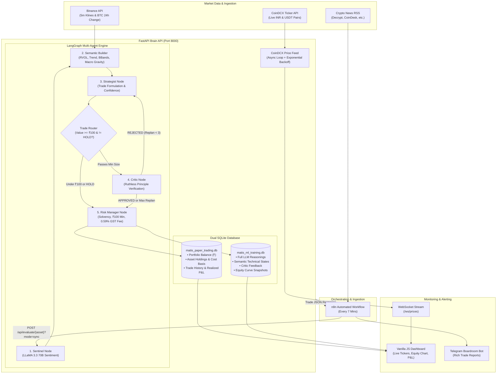

# MATIS v3 — Multi-Agent Trading Intelligence System

[](https://www.python.org/downloads/)
[](https://fastapi.tiangolo.com)
[](https://github.com/langchain-ai/langgraph)
[](https://www.nvidia.com/en-us/ai-data-science/foundation-models/)
[](https://coindcx.com)
[](https://matis.duckdns.org/)
[](https://opensource.org/licenses/MIT)

**MATIS (Multi-Agent Trading Intelligence System) v3** is an autonomous cryptocurrency paper-trading engine powered by a cooperative multi-agent LangGraph workflow. Running on **NVIDIA NIM (NVIDIA Nemotron-3-Super-120B-A12B)**, MATIS synthesizes real-time technical indicators, news sentiment, and Bitcoin macro gravity to evaluate, deliberate, criticize, and execute cryptocurrency trades.

Version 3 is architected specifically for a native **Indian Rupee (INR)** trading environment, simulating real-world **CoinDCX** order-book constraints (minimum ₹100 trade threshold, 0.5% base fee + 18% GST = ~0.59% total fee). It features silent **Machine Learning (ML) data logging** to train future models, an automated **n8n + Telegram** reporting loop, and a dark-mode **WebSocket dashboard**.

> [!TIP]
> **Live Instance**: A live deployment running the single news sentiment score agent and Python conditional statements version is available at: **[https://matis.duckdns.org/](https://matis.duckdns.org/)**

---

## Table of Contents

- [System Architecture](#system-architecture)
- [Multi-Agent Deliberation Pipeline](#multi-agent-deliberation-pipeline)
  - [1. Sentinel (News Sentiment)](#1-sentinel-news-sentiment)
  - [2. Semantic Builder (Indicator Translation)](#2-semantic-builder-indicator-translation)
  - [3. Strategist (Trade Proposal)](#3-strategist-trade-proposal)
  - [4. Cost-Optimized Graph Router](#4-cost-optimized-graph-router)
  - [5. Critic & Reflection Loop](#5-critic--reflection-loop)
  - [6. Risk Manager (Sizing & Constraint Enforcement)](#6-risk-manager-sizing--constraint-enforcement)
- [Key Features](#key-features)
- [Simulated CoinDCX Exchange Engine](#simulated-coindcx-exchange-engine)
- [Technical Indicator Engine](#technical-indicator-engine)
- [Dual SQLite Database Architecture](#dual-sqlite-database-architecture)
- [n8n Automation & Telegram Alerting](#n8n-automation--telegram-alerting)
- [Real-Time Web Dashboard](#real-time-web-dashboard)
- [API Reference](#api-reference)
  - [REST Endpoints](#rest-endpoints)
  - [WebSocket Stream](#websocket-stream)
- [Project Structure](#project-structure)
- [Setup & Installation](#setup--installation)
  - [Prerequisites](#prerequisites)
  - [Environment Variables](#environment-variables)
  - [Running the Server](#running-the-server)
  - [Triggering a Test Trade](#triggering-a-test-trade)
  - [Configuring the n8n Workflow](#configuring-the-n8n-workflow)
- [License](#license)

---

## System Architecture



---

## Multi-Agent Deliberation Pipeline

MATIS does not rely on a single, naive LLM prompt. Instead, it runs an orchestrated LangGraph state machine where multiple specialized agent personas scrutinize the trade before a single rupee is allocated.

```
                    ┌─────────────────────────┐
                    │      Sentinel Node      │  ← News headline sentiment (0.0 to 1.0)
                    └────────────┬────────────┘
                                 │
                    ┌────────────▼────────────┐
                    │  Semantic Builder Node  │  ← Raw numbers translated into descriptive context
                    └────────────┬────────────┘
                                 │
                    ┌────────────▼────────────┐
     ┌───────────── │     Strategist Node     │  ← Formulates action (BUY/SELL/HOLD), % allocation, reasoning
     │              └────────────┬────────────┘
     │                           │
     │              ┌────────────▼────────────┐
     │              │    check_trade_value    │
     │              └───────┬──────────┬──────┘
     │       Trade >= ₹100  │          │  HOLD or Trade < ₹100
     │                      │          │  (Fast-path bypass to save LLM tokens & latency)
     │              ┌───────▼──────┐   │
     │   REJECTED   │ Critic Node  │   │
     └──(replan < 3)└───────┬──────┘   │
                            │ APPROVED │
                            └────┬─────┘
                                 │
                    ┌────────────▼────────────┐
                    │    Risk Manager Node    │  ← Position sizing, CoinDCX ₹100 min check, 0.59% GST fee
                    └────────────┬────────────┘
                                 │
                    ┌────────────▼────────────┐
                    │    Execute & Record     │  ← Updates paper portfolio & logs to ML dataset
                    └─────────────────────────┘
```

### 1. Sentinel (News Sentiment)
- **Model**: `meta/llama-3.3-70b-instruct` via NVIDIA NIM.
- Evaluates inbound news headlines parsed by the n8n ingestion pipeline.
- Outputs a normalized sentiment score between `0.0` (extreme bearish/panic) and `1.0` (extreme bullish/euphoria).
- Falls back gracefully to neutral `0.50` if headlines are empty or API rate limits occur.

### 2. Semantic Builder (Indicator Translation)
- LLMs struggle to reason accurately over raw floating-point numbers. The Semantic Builder is a deterministic translation layer that converts math into structured domain intelligence:
  - **Trend**: Translates price relative to 9 EMA and 21 EMA (*"Price is trading ABOVE the 9 EMA and 21 EMA (Uptrend)"*).
  - **Momentum**: Translates Wilder's RSI into labeled regimes (*"Extremely Overbought"*, *"Mildly Bullish"*, *"Oversold"*).
  - **Volatility**: Evaluates price against Bollinger Bands bands (*"testing Upper Bollinger Band"*) and calculates dynamic stop-loss recommendations based on Average True Range (ATR).
  - **Volume**: Computes Relative Volume (RVOL) comparing the past hour's volume against the 24-hour average hourly volume.
  - **BTC Macro Gravity**: Benchmarks altcoin performance against Bitcoin's 24-hour price change (*"Bullish Market Gravity"* vs. *"Bearish Market Gravity"*).

### 3. Strategist (Trade Proposal)
- **Model**: `meta/llama-3.3-70b-instruct` (Temperature: `0.1`).
- Considers the entire semantic market package, available INR cash balance, and existing asset holdings.
- Proposes a concrete action (`BUY`, `SELL`, `HOLD`), an integer confidence score (`0` to `100`), an allocation percentage (`0%` to `100%`), and an exhaustive rationale.
- Implements self-healing retry parsing to enforce strict JSON schemas without runtime exceptions.

### 4. Cost-Optimized Graph Router
- To conserve NVIDIA NIM API quotas and minimize trade execution latency, the graph router inspects the Strategist's proposed order value:
  - If the action is `HOLD`, or if the proposed trade value is below the ₹100 minimum threshold, the router **bypasses the Critic entirely** and transitions immediately to the Risk Manager.

### 5. Critic & Reflection Loop
- **Model**: `meta/llama-3.3-70b-instruct`.
- Acts as a risk and logic auditor. It scrutinizes the proposal against market principles (e.g., rejecting attempts to BUY when RSI > 70 without explosive volume, or buying an altcoin fighting negative BTC macro gravity).
- **Reflection Loop**: If rejected, the critic sends targeted feedback back to the Strategist to replan. To prevent infinite loops, the system caps replanning at 2 iterations before forcing execution or fallback.

### 6. Risk Manager (Sizing & Constraint Enforcement)
- Operates strictly on portfolio mathematics and exchange rules:
  - Confirms the account has sufficient INR cash for `BUY` or coin balance for `SELL`.
  - Computes order size in coin units and calculates exact CoinDCX simulated fees (0.5% + 18% GST).
  - Flags blocked orders (`BLOCKED_COINDCX`) if the trade fails to meet the ₹100 threshold.
  - Passes approved trades to SQLite for ledger balance updates.

---

## Key Features

- **Native INR Architecture**: Trades priced directly in Indian Rupees (`BTCINR`, `ETHINR`, `SOLINR`, `XRPINR`, `BNBINR`, `LINKINR`).
- **Simulated CoinDCX Engine**: Rigidly enforces exchange-accurate constraints: ₹100 minimum trade limits and ~0.59% GST-inclusive transaction fees.
- **USDT/INR Dynamic Fallback**: In the rare event an INR pair quote is delayed, the system calculates synthetic pricing using live CoinDCX `USDTINR` conversion rates.
- **Zero-Dependency Indicator Engine**: All technical indicators (RSI, Bollinger Bands, ATR, 9/21 EMAs, RVOL) are implemented natively in pure Pandas/NumPy—no flaky C-bindings or TA-Lib required.
- **Continuous ML Data Logging**: Every trade deliberation (market condition, LLM reasoning chain, critic review, simulated fee, and net P&L) is saved to `matis_ml_training.db` for supervised fine-tuning and offline RL.
- **Dual Execution Endpoints**: Dual-purpose `/api/evaluate/{asset}` endpoint supporting asynchronous fire-and-forget execution for the web dashboard (`mode=async`) and synchronous execution with full execution details for n8n/Telegram pipelines (`mode=sync`).
- **Resilient Price Streamer**: Centralized price fetcher with exponential backoff on HTTP 429 rate limits, broadcasting tick data to web clients via WebSockets.
- **Glassmorphic Dark-Mode Dashboard**: Lightweight Vanilla JS/HTML interface featuring live WebSocket tickers, interactive Chart.js equity curves, cost basis tracking, and filterable trade logs.

---

## Simulated CoinDCX Exchange Engine

MATIS v3 bridges the gap between simulated paper trading and Indian exchange realities:

| Parameter | Configuration | Details |
|---|---|---|
| **Base Currency** | `INR (₹)` | All cash balances, valuations, and fees are tracked in INR. |
| **Starting Balance** | `₹10,000.00` | Configurable in `database.py` via `INITIAL_INR_BALANCE`. |
| **Minimum Order Size** | `₹100.00` | Trades below ₹100 are rejected by `validate_coindcx_trade`. |
| **Exchange Fee** | `0.50%` | Standard CoinDCX spot taker fee. |
| **GST on Fee** | `18.00%` | Applicable Goods & Services Tax on trading fees. |
| **Effective Fee Rate** | `~0.59%` | Calculated as: $\text{Trade Value} \times 0.005 \times 1.18$. |
| **Supported Baskets** | 6 Assets | `BTC`, `ETH`, `SOL`, `XRP`, `BNB`, `LINK`. |

### Cost Basis & Profit/Loss (P&L) Accounting
- **Average Entry Price**: Updated using weighted average pricing upon each `BUY`.
- **Realized P&L**: Computed upon each `SELL`:
  $$\text{Realized P&L} = (\text{Execution Price} - \text{Avg Entry Price}) \times \text{Units Sold} - \text{Simulated Fee}$$
- **Unrealized P&L**: Calculated in real-time across all active holdings against live CoinDCX spot prices.

---

## Technical Indicator Engine

Calculated natively using 5-minute candlestick data fetched from Binance public APIs:

- **Wilder's RSI (14 periods)**: Gauges market momentum and identifies overbought (>70) or oversold (<30) territories.
- **Bollinger Bands (20 periods, 2.0 std dev)**: Determines price volatility expansion/contraction and band extremity testing.
- **Average True Range (ATR, 14 periods)**: Measures market volatility to recommend dynamic stop-loss thresholds.
- **Exponential Moving Averages (9 & 21 EMAs)**: Pinpoints short-term trend direction and crossover dynamics.
- **Relative Volume (RVOL)**:
  $$\text{RVOL} = \frac{\sum \text{Volume of last 12 five-minute candles (1 hour)}}{\text{Average hourly volume over past 288 five-minute candles (24 hours)}}$$
- **BTC Macro Gravity**: Compares Bitcoin's 24-hour percentage price change to assess broad crypto market tailwinds or headwinds.

---

## Dual SQLite Database Architecture

To isolate transactional integrity from heavy analytic workloads, MATIS maintains two separate SQLite databases operating in **Write-Ahead Logging (WAL)** mode:

```
matis_backend/
├── matis_paper_trading.db    # Transactional paper exchange database
└── matis_ml_training.db      # Analytical dataset for model training
```

### 1. `matis_paper_trading.db`
- **`portfolio`**: Current INR cash balance and timestamp.
- **`holdings`**: Normalized table containing coin balances and weighted `avg_entry_price` for each supported asset.
- **`trade_history`**: Audit trail of every `BUY`, `SELL`, and `HOLD` action, transacted amounts, fill prices, fees paid, confidence scores, and realized profits.

### 2. `matis_ml_training.db`
- **`trade_logs`**: Captures the exact state of the world when the AI made its decision:
  - Asset, action, confidence, allocation fraction, entry price.
  - Quantitative sentiment score and translated market trend string.
  - Complete raw LLM reasoning from the Strategist.
  - Critic evaluation feedback.
  - Realized net P&L and terminal outcome status (`EXECUTED`, `HOLD`, `BLOCKED_COINDCX`).
- **`portfolio_snapshots`**: Records timestamps, total portfolio value, and liquid cash balances after every trade to generate historical equity curves.

---

## n8n Automation & Telegram Alerting

MATIS includes a pre-built orchestration workflow in `n8n workflow.json`:

1. **Schedule Trigger**: Fires every **7 minutes**.
2. **News Ingestion**: Ingests the latest crypto headlines from public RSS feeds (e.g., Decrypt).
3. **Item Looping**: Batches each asset (`BTC`, `ETH`, `SOL`, etc.) with its corresponding news context.
4. **Synchronous Brain Call**: Sends an HTTP POST request to:
   ```
   POST http://127.0.0.1:8000/api/evaluate/{{$json["asset"]}}?mode=sync
   ```
   *The server processes the LangGraph pipeline in a worker thread and keeps the HTTP request open until the trade settles.*
5. **Telegram Dispatcher**: Formats a boardroom summary and dispatches an instant Telegram push notification:

```text
🚨 MATIS Boardroom Report 🚨

🧠 STRATEGIST (Proposal):
BTC has broken above both 9 and 21 EMAs with RVOL at 2.1x. RSI sits at 54 (Mildly Bullish), supported by positive Bitcoin macro gravity (+3.2%). Proposing 15% allocation.

📰 SENTINEL (News): 
Sentiment Score: 0.72

⚖️ RISK MANAGER (Execution):
Action: BUY BTC at ₹8,420,150.00 worth ₹1,485.00
Confidence: 85%
```

---

## Real-Time Web Dashboard

- **Live Deployment**: A live instance running the single news sentiment score agent and Python conditional statements version is hosted at **[https://matis.duckdns.org/](https://matis.duckdns.org/)**.
- **Local Access**: Visit `http://localhost:8000` after launching the local server.

- **WebSocket Price Banner**: Live streaming INR rates directly from CoinDCX tickers.
- **Key Metrics Grid**:
  - Total Portfolio Valuation (Cash + Active Holdings marked-to-market).
  - Available Liquid INR Cash.
  - Multi-Asset Holding Distribution.
  - Global Net P&L (Split into Realized & Unrealized).
  - Selected Asset P&L with Average Entry Price and Cost Basis.
- **Chart.js Visualizations**:
  - **Portfolio Equity Curve**: Historical valuation timeline plotted from ML database snapshots.
  - **Asset Performance**: Net P&L attribution broken down by asset.
- **Interactive Trade History**: Filterable by asset (`BTC`, `ETH`, `SOL`, `XRP`, `BNB`, `LINK`) and action (`BUY`, `SELL`, `HOLD`), displaying full LLM reasoning snippets and confidence indicators.
- **Safe State Reset**: One-click portfolio wipe returning balance to ₹10,000 for fresh testing cycles.

---

## API Reference

### REST Endpoints

#### 1. Deliberate & Evaluate Asset
```http
POST /api/evaluate/{asset}?mode={async|sync}
```
Triggers the multi-agent pipeline for a specific asset (`BTC`, `ETH`, etc.).
- **Query Parameter**:
  - `mode=async` *(Default)*: Returns immediately with a `processing` status while the pipeline runs in a background thread.
  - `mode=sync`: Awaits pipeline completion and returns full execution details (used by n8n / Telegram).
- **Request Body** *(Optional)*:
  ```json
  {
    "asset": "BTC",
    "news": "Bitcoin surpasses key resistance level amidst institutional inflows."
  }
  ```
- **Sync Response (200 OK)**:
  ```json
  {
    "asset": "BTC",
    "action": "BUY",
    "status": "EXECUTED",
    "trade_value_inr": 1500.00,
    "fee_inr": 8.85,
    "units_transacted": 0.00017814,
    "execution_price_inr": 8420150.00,
    "allocation_pct": 15.0,
    "confidence": 85,
    "news_sentiment": 0.72,
    "reasoning": "Strong momentum confirmation above 9/21 EMAs.",
    "post_trade_inr_balance": 8491.15,
    "post_trade_asset_balance": 0.00017814,
    "total_portfolio_value_inr": 9991.15
  }
  ```

#### 2. Portfolio Summary
```http
GET /api/portfolio_summary
```
Calculates mark-to-market valuations across all held assets using live CoinDCX prices.
- **Response**:
  ```json
  {
    "inr_balance": 8491.15,
    "total_holdings_value": 1500.00,
    "total_portfolio_value": 9991.15,
    "net_pnl": -8.85,
    "net_pnl_pct": -0.0885,
    "global_realized_pnl": 0.00,
    "global_unrealized_pnl": -8.85,
    "initial_balance": 10000.0,
    "total_trades": 1
  }
  ```

#### 3. Asset-Specific Portfolio View
```http
GET /api/portfolio?asset=BTC&current_price=8420150.00
```
Returns cost basis, average entry price, and unrealized profit for a designated asset.

#### 4. Trade History
```http
GET /api/trades?limit=50
```
Returns recent trade execution records from `matis_paper_trading.db`.

#### 5. Machine Learning Trade Logs
```http
GET /api/ml/trades?limit=100&action=ALL&asset=ALL
```
Returns complete reasoning records, sentiment scores, and critic feedback from `matis_ml_training.db`.

#### 6. Portfolio Equity Curve
```http
GET /api/portfolio/equity?limit=200
```
Returns chronological total portfolio valuation snapshots for frontend charting.

#### 7. Live CoinDCX Prices
```http
GET /api/prices
```
Returns current cached spot prices for all tracked pairs.

#### 8. Reset Environment
```http
POST /api/reset
```
Wipes trade logs, resets holdings to zero, and restores liquid INR balance to ₹10,000.00.

#### 9. System Health
```http
GET /api/system
```
Returns uptime, CoinDCX background streamer health, and active asset counts.

---

### WebSocket Stream

```
ws://localhost:8000/ws/prices
```
Connect to receive real-time JSON price updates streamed directly from the background price fetcher:

```json
{
  "type": "price_update",
  "prices": {
    "BTC": { "price": 8420150.0, "change_24h": 2.15 },
    "ETH": { "price": 284500.0, "change_24h": -0.42 },
    "SOL": { "price": 14200.0, "change_24h": 5.12 },
    "XRP": { "price": 215.40, "change_24h": 1.10 },
    "BNB": { "price": 54100.0, "change_24h": 0.85 },
    "LINK": { "price": 1650.0, "change_24h": -1.20 }
  }
}
```

---

## Project Structure

```text
MATIS---Multi-Agent-Trading-Intelligence-System-Public/
├── README.md                     # Comprehensive project documentation
├── n8n workflow.json             # Automated news scraper & Telegram dispatch workflow
└── matis_backend/
    ├── main.py                   # FastAPI application, routes, lifespans & background tasks
    ├── graph.py                  # LangGraph state machine, nodes, routers & edges
    ├── agents.py                 # Sentinel, Strategist, Critic & Risk Manager agent logic
    ├── state.py                  # TypedDict schema definition for LangGraph AgentState
    ├── indicators.py             # Pure Pandas/NumPy technical indicators & semantic layer
    ├── database.py               # Paper trading portfolio & trade ledger (SQLite)
    ├── ml_database.py            # CoinDCX fee engine & ML training data logging (SQLite)
    ├── price_feed.py             # CoinDCX price polling with backoff & WebSocket manager
    ├── backfill_avg_price.py     # Utility migration script for cost-basis calculations
    ├── requirements.txt          # Python library dependencies
    ├── matis_paper_trading.db    # Transactional SQLite database
    ├── matis_ml_training.db      # ML analytical training SQLite database
    └── static/
        └── index.html            # Single-page Vanilla JS/CSS trading dashboard
```

---

## Setup & Installation

### Prerequisites
- **Python**: Version 3.10 or higher.
- **NVIDIA NIM API Key**: An active API key with access to `meta/llama-3.3-70b-instruct`. [Get your key here](https://build.nvidia.com/).
- **n8n** *(Optional, for automation)*: Local or cloud instance of n8n.
- **Telegram Bot** *(Optional, for notifications)*: Bot token and chat ID.

---

### Environment Variables

Create a `.env` file inside the `matis_backend/` directory:

```env
NVIDIA_API_KEY=nvapi-your-actual-nvidia-nim-api-key-here
```

---

### Running the Server

1. **Clone the repository:**
   ```bash
   git clone https://github.com/Kartik2048/MATIS---Multi-Agent-Trading-Intelligence-System-Public.git
   cd MATIS---Multi-Agent-Trading-Intelligence-System-Public
   ```

2. **Create and activate a virtual environment:**
   ```bash
   # Linux / macOS:
   python3 -m venv venv
   source venv/bin/activate

   # Windows (PowerShell):
   python -m venv venv
   .\venv\Scripts\Activate.ps1
   ```

3. **Install dependencies:**
   ```bash
   cd matis_backend
   pip install -r requirements.txt
   ```

4. **Launch the FastAPI application:**
   ```bash
   python main.py
   ```
   Or via Uvicorn directly:
   ```bash
   uvicorn main:app --host 0.0.0.0 --port 8000 --reload
   ```

5. **Open the Dashboard:**
   Navigate to [http://localhost:8000](http://localhost:8000) in your browser.

---

### Triggering a Test Trade

You can manually trigger an evaluation round using `curl` or PowerShell:

#### Synchronous (Waits for full decision output):
```bash
curl -X POST "http://localhost:8000/api/evaluate/BTC?mode=sync" \
     -H "Content-Type: application/json" \
     -d "{\"asset\": \"BTC\", \"news\": \"Bitcoin ETF volumes surge as institutional interest accelerates.\"}"
```

#### Asynchronous (Returns immediately, executes in background):
```bash
curl -X POST "http://localhost:8000/api/evaluate/ETH?mode=async" \
     -H "Content-Type: application/json" \
     -d "{\"asset\": \"ETH\", \"news\": \"Ethereum network gas fees drop following Layer 2 upgrades.\"}"
```

---

### Configuring the n8n Workflow

1. Open your n8n web interface.
2. Click **Import from File** and select [`n8n workflow.json`](file:///c:/Users/karti/Documents/MATIS---Multi-Agent-Trading-Intelligence-System-Public/n8n%20workflow.json).
3. Update the **Telegram** node credentials with your bot token and target chat ID.
4. Ensure the HTTP Request node points to your local MATIS server:
   ```
   http://127.0.0.1:8000/api/evaluate/{{$json["asset"]}}?mode=sync
   ```
5. Activate the workflow to automate multi-agent paper trading every 7 minutes.

---

## License

This project is licensed under the **MIT License**. See the LICENSE file for details.