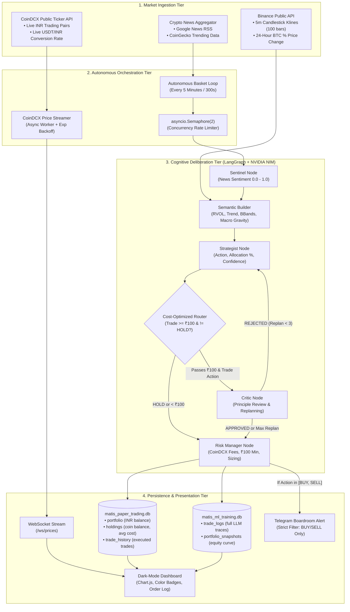

# System Architecture

## 1. Architectural Overview

MATIS v3 is designed around an asynchronous event-driven core implemented in **FastAPI** and **LangGraph**, operating with zero external database dependencies (using dual embedded **SQLite** instances with WAL journaling).

The architecture separates concerns into four distinct operational tiers:
1. **Market Ingestion Tier**: Fetches live Binance candlestick data, CoinDCX spot prices, and RSS/news feeds.
2. **Autonomous Orchestration Tier**: A background scheduler daemon executing full-basket evaluations under semaphore throttling.
3. **Cognitive Deliberation Tier**: The LangGraph multi-agent state machine running on NVIDIA NIM Nemotron/LLaMA foundation models.
4. **Persistence & Presentation Tier**: Dual SQLite transactional/analytical ledgers, WebSocket broadcast feeds, and an interactive dark-mode dashboard.

---

## 2. End-to-End System Flowchart



---

## 3. Detailed Component Breakdown

### A. CoinDCX Price Feed Worker (`price_feed.py`)
- **Execution**: Runs in a background `asyncio` loop created during FastAPI's lifespan startup.
- **Poll Interval**: Fetches ticker quotes every 5.0 seconds from `https://api.coindcx.com/exchange/ticker`.
- **Cached In-Memory Map**: Maintains real-time INR prices and 24-hour percentage changes for `BTC`, `ETH`, `SOL`, `XRP`, `BNB`, and `LINK`.
- **Exponential Backoff**: If CoinDCX returns HTTP 429 (Too Many Requests), the price worker increases backoff delays geometrically ($2\text{s} \to 4\text{s} \to 8\text{s} \dots \text{up to } 60\text{s}$) to avoid IP bans.
- **WebSocket Broadcast**: Distributes updated prices to all active clients connected to `ws://localhost:8000/ws/prices`.

### B. Technical Indicator Engine (`indicators.py`)
- **Pure Python Math**: Implemented with pure Pandas and NumPy without TA-Lib or C-compilation dependencies.
- **Binance Klines Feed**: Pulls the last 100 5-minute candles (`interval=5m`) for the designated asset.
- **Calculated Metrics**:
  - Wilder's RSI (14 periods)
  - Bollinger Bands (20 periods, 2.0 std dev)
  - Average True Range (ATR, 14 periods)
  - Exponential Moving Averages (9 & 21 EMAs)
  - Relative Volume (RVOL: last 1 hour volume vs. 24-hour hourly mean)
  - BTC 24-Hour Price Delta (Macro gravity)

### C. Autonomous Scheduler Loop (`main.py`)
- **Cycle Duration**: Fired every 300 seconds (5 minutes), configurable via `AUTO_EVALUATE_INTERVAL_SECONDS`.
- **Parallel Dispatch**: Evaluates all 6 coins simultaneously via `asyncio.gather(*tasks)`.
- **Concurrency Guard**: Regulated by `asyncio.Semaphore(2)` (configurable via `MAX_CONCURRENT_EVALUATIONS`) to ensure no more than 2 cognitive agent chains execute concurrently against NVIDIA NIM.
- **Automatic Fallback News**: If no manual news payload is supplied, scrapes real-time headlines via Google News RSS for the target asset.

### D. Dual SQLite Persistence Architecture
Operates in **Write-Ahead Logging (WAL)** mode for concurrent, lock-free reads while background threads write trades.

```text
matis_backend/
├── matis_paper_trading.db    # Transactional paper exchange ledger
└── matis_ml_training.db      # Full analytical dataset for model training
```

1. **`matis_paper_trading.db` Tables**:
   - `portfolio`: Holds the primary liquid cash balance (`inr_balance`).
   - `holdings`: Holds asset balances (`balance`) and weighted cost-basis (`avg_entry_price`).
   - `trade_history`: Detailed audit log of all decisions (`BUY`, `SELL`, and `HOLD`), transacted quantities, fill prices, fees, and realized gains.

2. **`matis_ml_training.db` Tables**:
   - `trade_logs`: Comprehensive cognitive trace recording market trend, sentiment score, Strategist's full LLM rationale, Critic's evaluation feedback, and terminal trade status.
   - `portfolio_snapshots`: Mark-to-market valuations and cash balances logged after each decision to plot historical equity curves.

---

## 4. Resilience & Error Handling

| Risk / Failure Mode | Mitigation Strategy | Implemented In |
|---|---|---|
| **NVIDIA NIM HTTP 503 Overload** | 3-attempt exponential backoff retry loop with jitter | `agents.py` |
| **NVIDIA NIM Concurrent Rate Limits** | `asyncio.Semaphore(2)` capping concurrent LLM calls | `main.py` |
| **CoinDCX HTTP 429 Rate Limits** | Async backoff with capped geometric delays up to 60s | `price_feed.py` |
| **Binance Kline Outage** | Graceful fallback returning neutral indicators | `indicators.py` |
| **Missing INR Pair Price** | Synthetic fallback calculated from live `USDTINR` quote | `main.py` / `price_feed.py` |
| **Sub-Minimum Order Value** | Exchange validator rejects orders under ₹100 (`BLOCKED_COINDCX`) | `ml_database.py` |
| **Insufficient Account Balance** | Solvency guard checks available cash before executing order | `database.py` |
