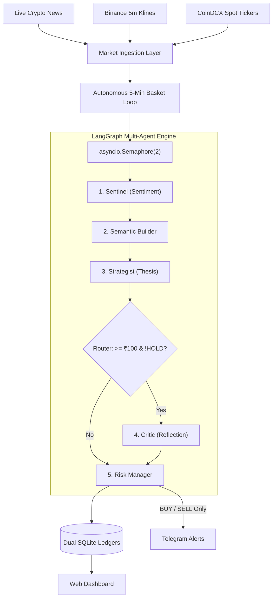

# MATIS v3 — Documentation Index

Welcome to the comprehensive technical documentation for the **MATIS (Multi-Agent Trading Intelligence System) v3** platform.

This documentation suite provides in-depth architectural analyses, mathematical specifications, agent cognitive pipeline breakdowns, and API references.

---

## Documentation Modules

| Chapter | Document | Topics Covered |
|---|---|---|
| **01** | [**Project Overview**](01_overview.md) | Introduction, core problem statement, architectural pillars, supported asset basket, and live deployment instance. |
| **02** | [**System Architecture**](02_system_architecture.md) | End-to-end system flowchart, four-tier architecture, component roles, background workers, and error resilience matrix. |
| **03** | [**Multi-Agent Deliberation Pipeline**](03_multi_agent_pipeline.md) | LangGraph state graph, `AgentState` schema, Sentinel, Semantic Builder, Strategist, Cost-Optimized Router, Critic reflection loop, and Risk Manager. |
| **04** | [**Exchange Simulation & Accounting**](04_exchange_simulation_and_accounting.md) | Native CoinDCX INR constraints, ₹100 minimum threshold, 0.59% GST fee mechanics, rolling average cost-basis, and realized/unrealized P&L formulas. |
| **05** | [**Autonomous Scheduler & Concurrency**](05_autonomous_scheduler_and_concurrency.md) | 5-minute autonomous basket loop, `asyncio.Semaphore(2)` throttling, NIM rate-limit protection, live news aggregation, and graceful server shutdown. |
| **06** | [**Telemetry, Alerting & Automation**](06_telemetry_and_alerting.md) | Telegram push alerts, strict `BUY`/`SELL` filtering (suppression on `HOLD`), rich boardroom report formatting, and n8n workflow orchestration. |
| **07** | [**Real-Time Web Dashboard**](07_web_dashboard.md) | Single-page HTML5/JS cockpit, WebSocket live ticker streaming, dedicated color-coded Asset badges, on-demand evaluation triggers, and Chart.js equity curves. |
| **08** | [**API Reference**](08_api_reference.md) | Comprehensive REST endpoint definitions, request/response JSON schemas, query parameters, and WebSocket feed specifications. |
| **09** | [**Testing & Verification**](09_testing_and_verification.md) | Test suite architecture, pytest isolation fixtures (`conftest.py`), temporary SQLite database sandboxes, module breakdowns, and test execution commands. |

---

## Quick Start Architecture Diagram

